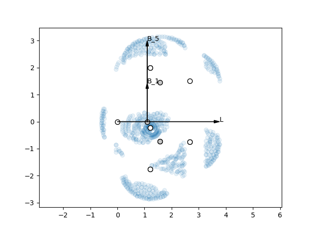

#README IS OUT OF DATE

# Steriplus
A Python package for calculation of steric descriptors. Steriplus can be run
either as a command line script or imported as a module.

## Example
#### Input
```
steriplus_sterimol isobutane.xyz 2 1
```

#### Output
| L    | B\_1 | B\_5 |
|------|------|------|
| 4.17 | 2.87 | 3.28 |

## Installation
```
pip install steriplus
```

### Dependencies
* matplotlib
* numpy
* scipy

## Usage
### Command line
```
steriplus <input file> <atom1> <atom2> --radii <radii-type> --density <density>
-v/--verbose
```  
or  
```
python -m steriplus <input file> <atom1> <atom2> --radii <radii-type> --density
<density> -v/--verbose
```

|Argument   | Description                                                    |
|-----------|----------------------------------------------------------------|
|input file | .xyz or Gaussian .gjf or .com                                  |
|atom1      | Index of dummy atom                                            |
|atom2      | Index of atom in the substituent connected to the dummy atom   |
|radii      | Type of van der Waals radii to use: "bondi" or "crc" (default) |
|density    | Density of points. Default value is 0.005 points/Å<sup>2</sup> |
|v/verbose  | Print uncorrected L and bond length between atom 1 and atom 2  |

### Module
#### Imports
```
from steriplus import read_gjf, read_xyz
from steriplus import Sterimol
```

#### Usage
##### Getting parameters
```
>>> elements, coordinates = read_xyz("isobutane.xyz")
>>> sterimol = Sterimol(elements, coordinates, 2, 1)
>>> sterimol.L_value
4.1692354497110005
```

##### Plotting in 2D
```
>>> sterimol.plot_2D()
```


```
>>> sterimol.plot_2D(plane="xy")
```



##### Plotting in 3D
Axes cannot currently be equally scaled with Matplotlib, so the perpsective is
flawed.
```
>>> sterimol.plot_3D()
```


#### More info
```
help(Sterimol)
```

## Background
The Sterimol parameters were developed by Verloop to describe the steric size
of substituents. L can be described as the depth of the substituent and is
defined as the distance between the dummy atom 1 (by definition H) and its
neighbor in substituent. For historical reasons, L is corrected by adding 0.40
to this length. This difference is due to a shift from C(sp<sup>2</sup>) to H
as dummy atom.

B<sub>1</sub> and B<sub>5</sub> can be described as the minimum and maximum
rotational size of the substituent. They are defined as the shortest and longest
vectors from atom 2 to a tangent plane of the vdW surface.

Steriplus calculates the Sterimol parameters by first generating points on the
vdW surface of the molecule and then projecting these points onto a set of
vectors. L is determined by projection onto the vector between atoms 1 and 2.
B<sub>1</sub> and B<sub>5</sub> are obtained by projection onto vectors
perpendicular to L.

Steriplus has been benchmarked against Paton's Sterimol package. Using the same
radii (Paton's modified Bondi), almost identical results are obtained. Note that
the Sterimol package uses 1.09 Å as the vdW radius for H, while Steriplus uses
1.10 Å as default (CRC radii).


### References
Verloop, A., Hoogenstraaten, W., Tipker, J. In Drug Design Vol. VII; Ariens, E. J., Ed.; Academic Press, 1976; pp 165-206.  
Verloop, A. In Pesticide Chemistry: Human Welfare and Environment: Synthesis and Structure-Activity Relationships; Doyle, P., Fujita, T., Eds.; Pergamon, 1983; pp 339–344.

## Change log
