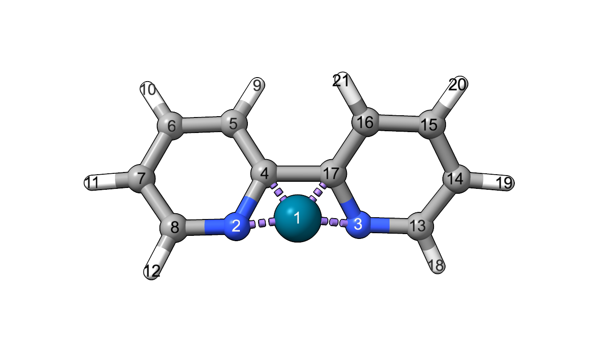
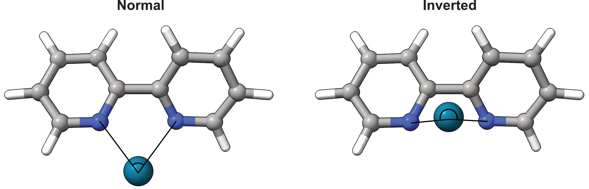

==========
Bite angle
==========

The bite angle is calculated as the angle between the two chelating ligand
atoms and the metal atom of a bidentate ligand. :footcite:`durand_2019`

******
Module
******

The BiteAngle class calculates the bite angle by from the coordinates, the
index of the metal atom and the indices of the two coordinating atoms.

.. code-block:: python
  :caption: Example

  >>> from morfeus import BiteAngle, read_xyz
  >>> elements, coordinates = read_xyz("bpy.xyz")
  >>> ba = BiteAngle(coordinates, 1, 2, 3)
  >>> ba.angle
  77.29254645757716

For more detailed information, use ``help(BiteAngle)`` or see the API:
:py:class:`BiteAngle <morfeus.bite_angle.BiteAngle>`

####################
Inverted bite angles
####################

The bite angle can become 'inverted' if it goes beyond 180°. This cannot be
detected automatically, so the user has to supply a ``ref_vector`` that should
point in the 'direction' of the ligand. As a convenience, the vector can be
constructed automatically from the metal atom to the geometric mean of a set of
given ``ref_atoms``.

In the example below, the bipyridine ligand has been artificially distorted to
give an inverted bite angle. The metal atom index is 1, and the indices of the
coordinating atoms are 2 and 3. The reference vector is constructed from the
metal atom to the geometric mean of the two reference atoms, 4 and 17.

.. code-block:: python
  :caption: Inverted

  >>> elements, coordinates = read_xyz("bpy_inverted.xyz")
  >>> ba = BiteAngle(coordinates, 1, 2, 3, ref_atoms=[4, 17])
  >>> ba.angle
  198.39710046622645
  >>> ba.inverted
  True

*******************
Command line script
*******************

The basic functionality is available through the command line script.

.. code-block:: console
  :caption: Example

  $ morfeus bite_angle bpy.xyz - 1 2 3 - angle
  77.29254645757716

.. code-block:: console
  :caption: Example inverted

  $ morfeus bite_angle bpy_inverted.xyz - 1 2 3 --ref_atoms='[4, 17]' - angle
  198.39710046622645

**********
Background
**********

The bite angle has a long history of use as a ligand descriptor.
:footcite:`durand_2019`. ᴍᴏʀғᴇᴜs extends to inverted bite angles, which
correspond to a bite angle above 180°.

.. footbibliography::
