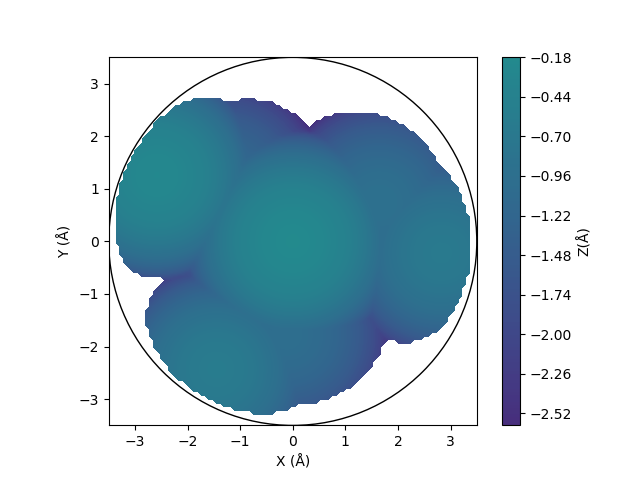

=============
Buried volume
=============

Buried volumes are implemented as described by Cavallo and co-workers
:footcite:`falivene_sambvca_2016`.

******
Module
******

The BuriedVolume class calculates the buried volume. Steric maps can also be
plotted.

.. code-block:: python
  :caption: Example

  >>> from morfeus import BuriedVolume, read_xyz
  >>> elements, coordinates = read_xyz("1.xyz")
  >>> bv = BuriedVolume(elements, coordinates, 1, excluded_atoms=[2, 3, 4, 5, 6, 7])
  >>> print(bv.fraction_buried_volume)
  0.2962110976518822
  >>> bv.print_report()
  V_bur (%): 29.6

By default, hydrogen atoms are excluded in the calculation. They can be added
by giving the keyword argument ``indclude_hs=True``. The metal atom is also
excluded, while the atoms of other ligands need to be given in the
``excluded_atoms`` list. The default sphere radius is 3.5 Å, but can be changed
with ``radius=<float>``. Default radii type is Bondi which are scaled by a
factor of 1.17. This can be changed with ``radii_type=<str>`` and
``radii_scale=<float>``. Custom radii can be supplied as a list with
``radii=<list>``.

For more information, use ``help(BuriedVolume)`` or see the API:
:py:class:`BuriedVolume <morfeus.buried_volume.BuriedVolume>`

#####################
Quadrants and octants
#####################

The buried volume can be decomposed into contributions from quadrants and
octants using the
:py:meth:`octant_analysis <morfeus.buried_volume.BuriedVolume.octant_analysis>`
method. To get meaningful results, the system should to be oriented in a
reproducible way. Orientation is acheived by specifiying the
``z_axis_atoms=<list>``and ``xz_plane_atoms=<list>`` keyword arguments. For
more information on the orientation convention, see the original reference
:footcite:`falivene_sambvca_2016`.

z-axis orientation
  The list of atom indices from ``z_axis_atoms`` is used to define the
  direction of the z axis. The axis will be oriented from the geometric center
  of the atoms in the list to the metal atom.

xz-plane orientation
  The list of atom indices from ``xz_plane_atoms`` is used to define the
  orientation of the xz-plane. The coordinate system will be rotateed so that
  the geometric mean of the given atoms lies in the xz plane.

The results of the octant analysis is stored in the ``octants`` attribute,
giving percent buried volume, buried volume (in ų) and the free volume (in ų)
for each octant.

.. code-block:: python
  :caption: Quadrant and octant analysis

  >>> bv = BuriedVolume(elements, coordinates, 1,
  ... excluded_atoms=[2, 3, 4, 5, 6, 7],
  ... z_axis_atoms=[14],
  ... xz_plane_atoms=[11])
  >>> bv.octant_analysis()
  >>> bv.octants
  {'percent_buried_volume': {0: 0.0, ...},
   'buried_volume': {0: 0.0, ...},
   'free_volume': {0: 22.449297503777064, ...}}
  >>> bv.quadrants
  {'percent_buried_volume': {1: 27.53214685054044, ...},
   'buried_volume': {1: 12.361547111309221, ...},
   'free_volume': {1: 32.53704789624491, ...}}

The octants are numbered__ from 0–7 according to the Gray code and their signs
are given by the
:py:data:`OCTANT_SIGNS <morfeus.buried_volume.OCTANT_SIGNS>` dictionary.
The quadrants are numbered from 1–4 corresponding to the Roman numerals I–V and
the corresponding signs are given in the
:py:data:`QUADRANT_SIGNS <morfeus.buried_volume.QUADRANT_SIGNS>` dictionary.

.. __: https://en.wikipedia.org/wiki/Octant_(solid_geometry)

#############
Distal volume
#############

The **distal volume** is the volume of the ligand beyond the sphere. It can
be computed with the
:py:meth:`compute_distal_volume <morfeus.buried_volume.BuriedVolume.compute_distal_volume>`
method. Using ``method="sasa"`` is faster, while ``method="buried_volume"``
allows octant and quadrant decompositon of the distal volume. This will add
the entries ``distal_volume`` and ``molecular_volume`` to the results.

.. code-block:: python
  :caption: Distal volume

  >>> bv = BuriedVolume(elements, coordinates, 1,
  ... excluded_atoms=[2, 3, 4, 5, 6, 7],
  ... z_axis_atoms=[14],
  ... xz_plane_atoms=[11])
  >>> bv.distal_volume
  273.2150492473022
  >>> bv.octant_analysis()
  >>> bv.compute_distal_volume(method="buried_volume", octants=True)
  >>> bv.octants
  {'percent_buried_volume': {0: 0.0, ...},
   'buried_volume': {0: 0.0, ...},
   'free_volume': {0: 22.449297503777064, ...},
   'distal_volume': {0: 0.0, ...},
   'molecular_volume': {0: 0.0, ...}}

########
Plotting
########

A steric map can be plotted with
:py:meth:`plot_steric_map <morfeus.buried_volume.BuriedVolume.plot_steric_map>`
if the ``z_axis_atoms=<list>`` keyword has been given.

.. code-block:: python
  :caption: Steric map

  >>> from morfeus import BuriedVolume, read_xyz
  >>> elements, coordinates = read_xyz("1.xyz")
  >>> bv = BuriedVolume(elements, coordinates, 1, excluded_atoms=[2, 3, 4, 5, 6, 7], z_axis_atoms=[2])
  >>> bv.plot_steric_map()

Plots can be saved by passing the ``filename=<str>`` keyword argument.
:py:meth:`draw_3D <morfeus.buried_volume.BuriedVolume.draw_3D>` gives a
three-dimensional representation of the buried volume.

*******************
Command line script
*******************

The basic functionality is available through the command line script.

.. code-block:: console
  :caption: Example

  $ morfeus buried_volume 1.xyz - 1 --excluded_atoms='[2,3,4,5,6,7]' - print_report
  V_bur (%): 29.6

**********
Background
**********

The percent of buried volume is a measure of the steric hindrance induced by a
ligand of a transition metal complex :footcite:`falivene_sambvca_2016`. A web
tool to calculate buried volumes, SambVca, was made available for scientific
purposes by Cavallo and co-workers in 2009 :footcite:`poater_sambvca_2009` with
version 2 in 2016 :footcite:`falivene_sambvca_2016`. .

The approach of ᴍᴏʀғᴇᴜs differs somewhat from that in ref.
:footcite:`falivene_sambvca_2016` in that points are generated uniformly in the
test sphere rather than considering voxels. The numerical results with standard
settings are the same though as shown by benchmarks on complexes 1-18 from ref.
:footcite:`falivene_sambvca_2016`. Steric maps also match those in ref.
:footcite:`falivene_sambvca_2016`.

.. footbibliography::
