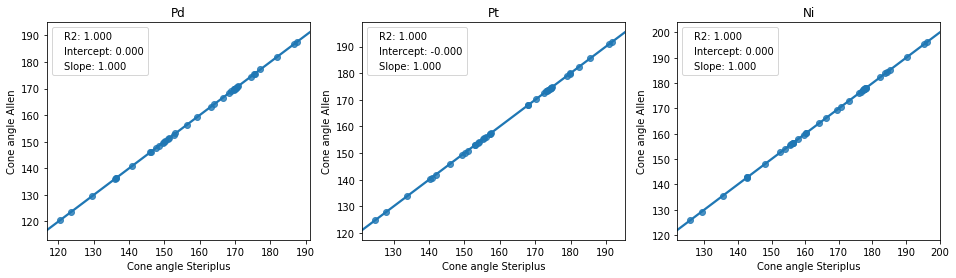
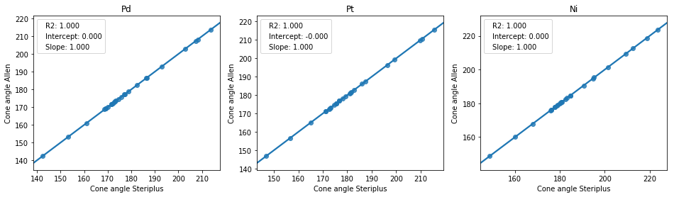

##########
Cone angle
##########

Exact cone angles are implemented as described by Allen and co-workers
:cite:`bilbrey_exact_2013`.

*******************
Command line script
*******************

The command line script provides access to the basic functionality through the
terminal.

.. code-block:: console
  :caption: Example
  
  $ morfeus_cone_angle PdPMe3.xyz 1
  Cone angle: 117.1
  No. tangent atoms: 3

The index of the metal atom is given as the second argument.

--radii <str>
  Choice of vdW radii: ``bondi`` or ``crc`` (default)

More information is given with ``morfeus_cone_angle --help``

******
Module
******

The ConeAngle class is provided to calculate and store the cone angles. 

.. code-block:: python
  :caption: Example
  
  >>> from morfeus import ConeAngle, read_xyz
  >>> elements, coordinates = read_xyz("phosphines/PdPMe3.xyz")
  >>> cone_angle = ConeAngle(elements, coordinates, 1)
  >>> print(cone_angle.cone_angle)
  117.11012922937584
  >>> print(cone_angle.tangent_atoms)
  [5, 9, 12]
  >>> cone_angle.print_report()
  Cone angle: 117.1
  No. tangent atoms: 3
  >>> cone_angle.plot_3D()

The Bondi vdW radii are used in reference :cite:`bilbrey_exact_2013`, but radii
from the CRC Handbook is the default here. It can be changed with
``radii_type=<str>`` with either ``crc`` or ``bondi``. Custom radii can passed
with ``radii=<list>``.

For more detailed information, use ``help(ConeAngle)`` or see the API:
:py:class:`morfeus.morfeus.ConeAngle`

**********
Background
**********

Cone angles is a method invented by Tolman for assessing the steric size of 
ligands :cite:`tolman_steric_1977`. The original Tolman cone angles for
phosphines have problems with asymmetric ligands and are not implemented in
this package. Instead, the exact cone angles :cite:`bilbrey_exact_2013` are
used. These are also defined for multidentate ligands.

The method implemented in ᴍᴏʀғᴇᴜs is taken directly from the article by Allen
:cite:`bilbrey_exact_2013`. The results have been benchmarked against Table 1
of the original article and agree within numerical accuracy.

  
  Benchmark of minimum cone angles from Table 1 of ref.
  :cite:`bilbrey_exact_2013`

  Benchmark of maximum cone angles from Table 1 of ref.
  :cite:`bilbrey_exact_2013`

**********
References
**********

.. bibliography:: refs.bib
  :style: unsrt
  :filter: docname in docnames