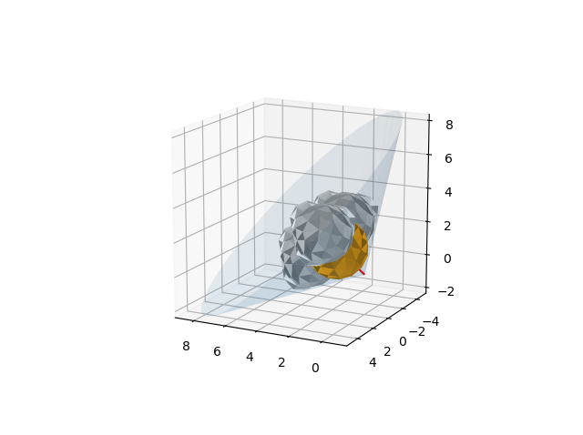
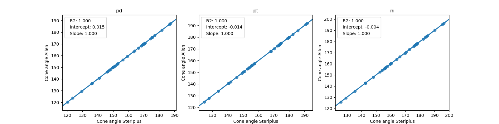
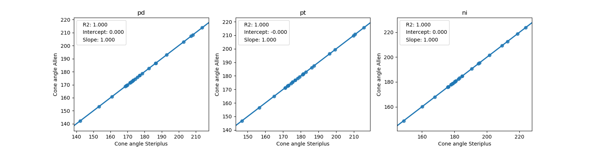

###########
Cone angles
###########

Exact cone angles are implemented as described by Allen and co-workers [1]_.

*******************
Command line script
*******************

The command line script provides access to the basic functionality through the 
terminal.

.. code-block:: console
  :caption: Example
  
  $ steriplus_cone_angle PdPMe3.xyz 1
  Cone angle: 117.1
  No. tangent atoms: 3

The index of the metal atom is given as the second argument. Choice of vdW 
radii can be changed through ``--radii {radii}`` with either "bondi" or
"crc" (default). 

More information is given with ``steriplus_cone_angle --help``

******
Module
******

The ConeAngle class is provided. 

.. code-block:: python
  :caption: Example
  
  >>> from steriplus import ConeAngle, read_xyz
  >>> elements, coordinates = read_xyz("phosphines/PdPMe3.xyz")
  >>> cone_angle = ConeAngle(elements, coordinates, 1)
  >>> print(cone_angle.cone_angle)
  117.11012922937584
  >>> print(cone_angle.tangent_atoms)
  [5, 9, 12]
  >>> cone_angle.print_report()
  Cone angle: 117.1
  No. tangent atoms: 3
  >>> cone_angle.plot_3D()

The Bondi vdW radii are used in reference [1]_, but radii from the CRC Handbook
is the default here. Custom radii can be used by passing a list with
``ConeAngle(elements, coordinates, atom_1, radii=radii_list``.

For more detailed information, use ``help(ConeAngle)`` or see the API.

**********
Background
**********

Cone angles is a method invented by Tolman for assesing the steric size of 
ligands [2]_. The original Tolman cone angles for phosphines have problems with
asymmetric ligands and are not implemented in this pakckage. Instead, the exact
cone angles are used. These are also defined for multidentate ligands.

The method implemented in Steriplus is taken directly from the article by Allen
[1]_. The results have been benchmarked against Table 1 of the original article
and agree within numerical accuracy.

  
  Benchmark of minimum cone angles from Table 1 of ref. [1]_

  Benchmark of maximum cone angles from Table 1 of ref. [1]_

**********
References
**********
.. [1] Bilbrey, J. A.; Kazez, A. H.; Locklin, J.; Allen, W. D. J. Comput.
  _Chem. 2013, 34, 1189.
.. [2] Tolman, C. A. Chem. Rev. 1977, 77, 313.