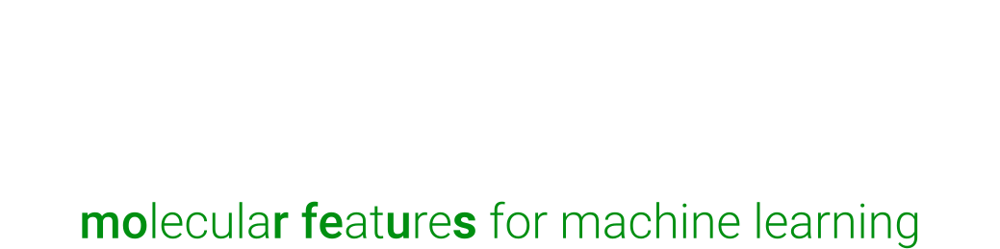

.. image:: _static/logo-light.svg
   :align: center
   :class: only-light

ᴍᴏʀғᴇᴜs calculates molecular features from 3D structures with a focus on steric
descriptors. It can be used as a Python library or through command line
scripts.

********
Examples
********

ᴍᴏʀғᴇᴜs can be imported as a Python module that is easily integrated into
workflows. It can also be used from the command line. Here is an example for
calculating the exact ligand cone angle:

.. tab:: Module

  .. code-block:: python

    >>> from morfeus import ConeAngle, read_xyz
    >>> elements, coordinates = read_xyz("PdPMe3.xyz")
    >>> cone_angle = ConeAngle(elements, coordinates, 1)
    >>> print(cone_angle.cone_angle)
    117.11012922937584

.. tab:: Command line

  .. code-block:: console

    $ morfeus cone_angle PdPMe3.xyz - 1 - cone_angle
    117.11012922937584

************
Installation
************

.. tab:: pip

  .. code-block:: console

    $ pip install morfeus-ml

.. tab:: conda

  .. code-block:: console

    $ conda install -c conda-forge morfeus-ml

********
Features
********

* Bite angle
* Buried volume
* Conformer tools
* Dispersion descriptor
* Exact ligand cone angle
* Ligand solid angle
* Local force constant
* Pyramidalization
* Solvent accessible surface area
* Sterimol parameters
* XTB electronic descriptors

*****
About
*****

ᴍᴏʀғᴇᴜs was started by Kjell Jorner as a post doc at AstraZeneca UK in
collaboration with the groups of Alán Aspuru-Guzik at the University of
Toronto, Matthew Sigman at the University of Utah and Tobias Gensch at TU
Berlin. In particular, the following people have contributed significantly to
developing its functionality:

* Gabriel dos Passos Gomes
* Pascal Friedrich
* Tobias Gensch

*******
License
*******

ᴍᴏʀғᴇᴜs is released under the `MIT license`_ and is thus completely free for
both academic and commercial use.

.. toctree::
   :maxdepth: 3
   :caption: Getting started
   :hidden:

   installation
   notes
   cli

.. toctree::
   :maxdepth: 3
   :caption: Methods
   :hidden:

   bite_angle
   buried_volume
   cone_angle
   conformer
   dispersion
   local_force
   pyramidalization
   sasa
   solid_angle
   sterimol
   xtb

.. toctree::
   :maxdepth: 3
   :caption: API
   :hidden:

   api/morfeus

.. toctree::
  :maxdepth: 3
  :caption: Source
  :hidden:

  GitHub <https://github.com/kjelljorner/morfeus>

.. _MIT license: https://en.wikipedia.org/wiki/MIT_License
