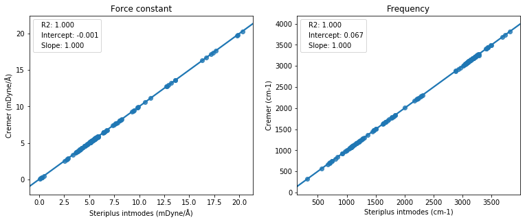
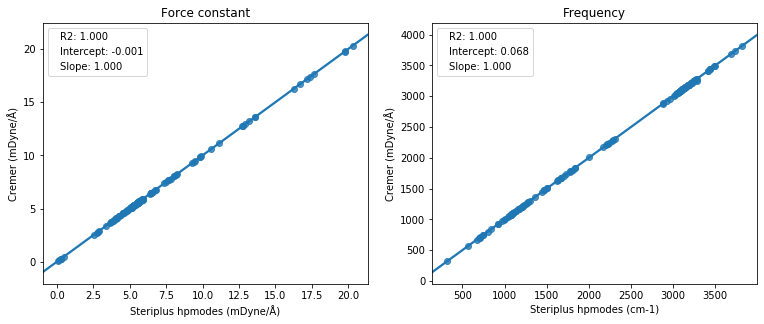
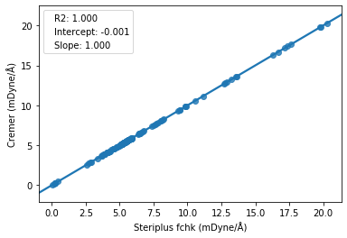
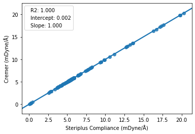

=====================
Local force constants
=====================

Local force constants can be calculated with the local modes method [1]_ or the
compliance matrix method [2]_. Steriplus can use the output of Gaussian_, xtb_,
or UniMoVib_ programs.

***************
Preparing input
***************

The LocalForce class needs input from quantum-chemical frequency calculations.
This input can either be read using the `load_file` method, or alternatively
a Hessian from memory can be used. The following information is needed for each
method:

.. csv-table:: Information required
  :header: "Method", "Elements", "Coordinates", "Internal modes", "Hessian"
  :align: center

  "Local modes", "x", "x", "", "x"
  "Compliance", "x", "x", "x", ""

************************
Preparing Gaussian input
************************

Depending on if you want to use the local modes method (recommended) or the 
compliance matrix method, different inputs for Gaussian are needed.

###########
Local modes
###########

The local modes method needs normal modes decomposed into contributions from
internal coordinates as well as normal mode force constants.

1. Normal mode decomposition in Gaussian
  This is the easiest way. Only the log file is required.
    ``#p freq(intmodes) iop(7/75=-1) iop(1/33=3)``
2. Normal mode decomposition from high precision normal modes
  This might increase the accuracy somewhat. Only log file is required.
    ``#p freq(intmodes,hpmodes) iop(1/33=3)``
3. Normal mode decomposition from very high precision normal modes and force
constants
  This is the highest accuracy mode. Both the log file and fchk file are
  required. The fchk file is generated with the Gaussian formchk program.
    ``#p freq(intmodes) iop(1/33=3)``

#################
Compliance matrix
#################

The compliance matrix method needs the force constant matrix (Hessian).

1. Force constant matrix from the log file
    ``#p freq(intmodes) iop(1/33=3)``
2. Higher-accuracy force constant matrix from the fchk file
    ``#p freq(intmodes) iop(1/33=3)``
3. Highest-accuarcy force constant matrix from PES file.
    ``#p freq(intmodes) iop(1/33=3) iop(7/32=3)``

*******************
Command line script
*******************

The command line script provides access to the basic functionality through the 
terminal.

.. code-block:: console
  :caption: Example of single internal coordinate
  
  $ steriplus_local_force freq-hp.log -a 1 2
  5.364

.. code-block:: console
  :caption: Example of report
  
  $ steriplus_local_force freq-hp.log
    Atom_1    Atom_2    Atom_3    Atom_4                           Force constant(mDyne/Å)                       Frequency (cm^-1)
         1         2                                                                 5.364                                    3252
         1         3                                                                 5.364                                    3252
         1         4                                                                 5.364                                    3252
         1         5                                                                 5.364                                    3252

-a <list>
  List of atoms in the bond/internal coordinate.
--cutoff <float>
  Cutoff value for low-frequency modes (default:0.001)
--fchk_file <str>
  Name of Gaussian fchk file
--method <str>
  Method: "local" (default) or "compliance"
--no_project_imaginary
  Flag to disable projection of imaginary modes
--pes_file <str>
  Name of Gaussian PES file
  
More information is given with ``steriplus_local_force --help``

******
Module
******

The LocalForce class is provided to calculate and store the local force
constants.

.. code-block:: python
  :caption: Example with local modes method

  >>> from steriplus import LocalForce
  >>> lf = LocalForce("freq-lm.log")
  >>> fc = lf.get_local_force_constant([1, 2])
  >>> print(fc)
  5.364289643211871

.. code-block:: python
  :caption: Example with compliance matrix method

  >>> from steriplus import LocalForce
  >>> lf = LocalForce("freq-lm.log", fchk_file="freq.fchk", method="compliance")
  >>> fc = lf.get_local_force_constant([1, 2])
  >>> print(fc)
  5.364476039405804

For the local modes method, projection of imaginary frequencies can be
controlled with the ``project_imag=<bool>``. The cutoff for low-freqency modes
can be controlled with ``cutoff=<float>``. Choice of method is controlled with
``method=<str>`` using either ``local`` (default) or ``compliance``. File names
of any fchk file and PES are specified with the ``fchk_file=<str>`` and
``pes_file=<str>`` keywords.

For more detailed information, use ``help(LocalForce)`` or see the API:
:py:class:`steriplus.steriplus.LocalForce`

**********
Background
**********

Local force constants describe the bond strength based on vibrational
frequencies. In the literature, there are two approaches to this, the local
modes method of Cremer [1]_ and the compliance matrix method championed by
Grunenberg [2]_. They have been shown to be equivalent within numerical accuracy
[3]_. Steriplus can use either method, and they give almost identical results
for most bonds. The exception is when imaginary or very small vibrational
frequencies exist. In this case, the numerical stability of the local modes
approach can be improved by two methods: (1) projecting out normal modes with
imaginary frequencies and (2) raising the force constants of the low-frequency
modes to a cutoff value. Steriplus does this projection by default and uses a 
cutoff of 0.001 mDyne/Å for low-frequency modes. We therefore recommend local
modes with default settings as the most robust method. Expert users can turn off this
projection and alter the cutoff value.

Note that interactions involving imaginary modes (such as breaking/forming
bonds in transition states) cannot be assessed by the local force constants.

The results have been benchmarked against the local force constants and
frequencies for small organic molecules given by Cremer [3]_. 

  
  Benchmark of local force constants and frequencies against data from Table 1
  of ref. [3]_. Data obtained using the local modes method with recipe 1.

  
  Benchmark of local force constants and frequencies against data from Table 1
  of ref. [3]_. Data obtained using the local modes method with recipe 2.

  
  Benchmark of local force constants and frequencies against data from Table 1
  of ref. [3]_. Data obtained using the local modes method with recipe 3.

  
  Benchmark of local force constants and frequencies against data from Table 1
  of ref. [3]_. Data obtained using the compliance matrix method with recipe 2.

**********
References
**********

.. [1] Konkoli, Z.; Cremer, D. Int. J. Quantum Chem. 1998, 67, 1.
.. [2] Brandhorst, K.; Grunenberg, J. Chem. Soc. Rev. 2008, 37, 1558.
.. [3] Zou, W.; Kalescky, R.; Kraka, E.; Cremer, D. J. Chem. Phys. 2012, 137, 84114.

.. _Gaussian: https://gaussian.com/
.. _UniMoVib: https://github.com/zorkzou/UniMoVib
.. _xtb: https://xtb-docs.readthedocs.io/en/latest/contents.html
