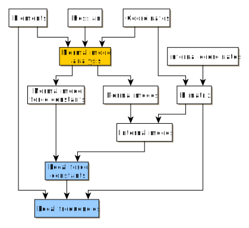
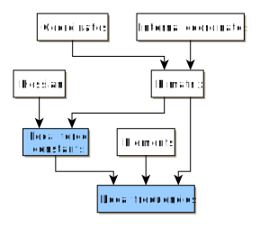

=====================
Local force constants
=====================

Local force constants can be calculated with the local modes method
:footcite:`konkoli_new_1998` or the compliance matrix method
:footcite:`brandhorst_how_2008`. ᴍᴏʀғᴇᴜs can use the output of the Gaussian__,
xtb__, or UniMoVib__ programs.

***************
Preparing input
***************

The LocalForce class needs input from quantum-chemical frequency calculations.
Therefore, the instructions are a bit more involved. This input can be read
using the ``load_file`` method, and ᴍᴏʀғᴇᴜs can also calculate some quantities
using its built-in normal mode analysis and internal coordinate codes.

###########
Local modes
###########

The local modes approach needs the normal modes in internal coordinates, here
called *internal modes*, as well as the normal mode force constants. The
internal modes can either be read from file or calculated with ᴍᴏʀғᴇᴜs.
Specifically, the internal modes can be computed from the normal modes and the
Wilson B matrix. For local frequencies, additional input is needed.

  Input needed for the local modes approach.

#################
Compliance matrix
#################

The compliance matrix method needs the Hessian matrix and the Wilson B matrix.
For local frequencies, the elements are also needed (for their atomic masses).

  Input needed for the compliance matrix method.

#################
Recommended input
#################

The table below summarizes the recommended input to ᴍᴏʀғᴇᴜs from the
supported programs. More details are given below.

.. table:: Recommended input.
  :widths: auto
  :align: center

  =========== ======== ========= =======
  Method      Gaussian UniMoVib  xtb
  =========== ======== ========= =======
  Local modes log      log       hessian
  Compliance  fchk     umv/local hessian
  =========== ======== ========= =======

########
Gaussian
########

Gaussian can provide the complete input for both the local modes and the
compliance matrix methods. The *log* file is recommended as input for the the
local modes method, and the *fchk* file for the compliance matrix method.
The Gaussian input file should be prepared with the following keywords
included (appropriate method and basis set need to be added as well).

==== =========================================
log  ``freq=intmodes iop(7/75=-1) iop(1/33=3)``
fchk ``freq=intmodes``
==== =========================================

``iop(7/75=1)`` triggers printing of the internal modes with full accuracy,
while ``iop(1/33=3)`` triggers printing of the Wilson B matrix. The table below
lists all the quantities read by each approach. fchk files should be generated
with ``formchk -3`` to obtain maximum printout of internal coordinates.

.. table:: Quantities from Gaussian files.
  :widths: auto
  :align: center

  ==================== === ===
  Quantity             log fck
  ==================== === ===
  Elements              x   x
  Coordinates           x   x
  Internal modes        x
  Internal coordinates  x   x
  B Matrix              x
  Normal modes              x
  Hessian                   x
  Force constants       x   x
  ==================== === ===

.. note::

  Additional accuracy for local modes calculations can be achieved by loading
  also the *fchk* file which contains the normal mode force constants to
  higher accuracy.

########
UniMoVib
########

The UniMoVib program can do vibrational analysis for a range of different
quantum-chemical programs. The user needs to define internal coordinates in
addition to the information that can be read from the files. For the local
modes method, the *log* file is recommended. For the compliance matrix method,
either the *umv* or the *local* files are recommended.

.. table:: Quantities from UniMoVib files.
  :widths: auto
  :align: center

  ==================== ===== === ===
  Quantity             local log umv
  ==================== ===== === ===
  Elements             x     x   x
  Coordinates          x     x   x
  Internal modes
  Internal coordinates
  B Matrix
  Normal modes         x     x
  Hessian              x         x
  Force constants            x
  ==================== ===== === ===

The *log* file is the standard output of the program. The *umw* file and the
*local* file can be generated by specifying them in the input file:

.. code-block:: none
  :emphasize-lines: 5, 6
  :caption: Example UniMoVib input file

  a test job

  $contrl
    qcprog="gaussian"
    iflocal=.t.
    ifsave=.t.
  $end

  $qcdata
    fchk="freq.fchk"
  $end

###
xtb
###

The xtb program can provide the Hessian. The file *hessian* is generated by the
xtb program as a result of a frequency calculation. It needs to be used
together with a normal mode analysis and separate internal coordinate input.

.. table:: Quantities from xtb files.
  :widths: auto
  :align: center

  ==================== =======
  Quantity             hessian
  ==================== =======
  Elements
  Coordinates
  Internal modes
  Internal coordinates
  B Matrix
  Normal modes
  Hessian              x
  Force constants
  ==================== =======

######################
Geometry optimizations
######################

Local force constants and frequencies are based on the harmonic approximation
that is valid only at stationary points (minima and transition states) on the
potential energy surface. Therefore, the geometry optimizations need to be of
good quality. For difficult examples on flat surfaces, this can mean
increasing the convergence criteria of the quantum-chemical program.
Vibrations with small imaginary frequencies should be eliminated as much as
possible. The local modes method with standards settings is somewhat robust to
the presence of these vibrations , while they can result in artifacts with the
compliance matrix method. Therefore, the local modes method is recommended in
these cases.

For transition states, the imaginary mode corresponding to the reaction is
projected out with the local modes approach. This also means that local force
constant involving the atoms corresponding to this imaginary mode are
meaningless and should not be used. Only the local modes method can be used
for transition states.

.. warning::

  Transition states can only be treated with the local modes method. Force
  constants and frequencies of the atoms corresponding to the imaginary mode
  should not be used.

******
Module
******

The LocalForce class is provided to calculate and store the local force
constants and frequencies.

.. code-block:: python
  :caption: Example with Gaussian and local modes method.

  >>> from morfeus import LocalForce
  >>> lf = LocalForce()
  >>> lf.load_file("freq-lm.log", "gaussian", "log")
  >>> lf.compute_local()
  >>> lf.compute_frequencies()
  >>> fc = lf.get_local_force_constant([1, 2])
  >>> print(fc)
  5.364289643211871
  >>> freq = lf.get_local_frequency([1, 2])
  >>> print(freq)
  3129.3126301763527

.. code-block:: python
  :caption: Example with Gaussian and compliance matrix method.

  >>> from morfeus import LocalForce
  >>> lf = LocalForce()
  >>> lf.load_file("freq.fchk", "gaussian", "fchk")
  >>> lf.compute_compliance()
  >>> lf.compute_frequencies()
  >>> fc = lf.get_local_force_constant([1, 2])
  >>> print(fc)
  5.364398642985929
  >>> freq = lf.get_local_frequency([1, 2])
  >>> print(freq)
  3129.352986019491

.. code-block:: python
  :caption: Example with xtb and local modes method.

  >>> from morfeus import LocalForce, read_xyz
  >>> elements, coordinates = read_xyz("xtbopt.xyz")
  >>> lf = LocalForce(elements, coordinates)
  >>> lf.load_file("hessian", "xtb", "hessian")
  >>> lf.normal_mode_analysis()
  >>> lf.detect_bonds()
  >>> print(lf.internal_coordinates)
  [Bond(1, 4), Bond(1, 3), Bond(1, 2), Bond(1, 5)]
  >>> lf.compute_local()
  >>> lf.compute_frequencies()
  >>> fc = lf.get_local_force_constant([1, 2])
  >>> print(fc)
  5.190222259808879
  >>> freq = lf.get_local_frequency([1, 2])
  >>> print(freq)
  3078.130379468432

.. code-block:: python
  :caption: Example with UniMoVib and the local modes method.

  >>> from morfeus import LocalForce
  >>> lf = LocalForce()
  >>> lf.load_file("job.out", "unimovib", "log")
  >>> lf.detect_bonds()
  >>> lf.compute_local()
  >>> lf.compute_frequencies()
  >>> fc = lf.get_local_force_constant([1, 2])
  >>> print(fc)
  5.364347084281302
  >>> freq = lf.get_local_frequency([1, 2])
  >>> print(freq)
  3129.337947449028

.. code-block:: python
  :caption: Example with adding internal coordinates manually
  :emphasize-lines: 4-7

  >>> from morfeus import LocalForce
  >>> lf = LocalForce()
  >>> lf.load_file("job.out", "unimovib", "log")
  >>> lf.add_internal_coordinate([1, 2])
  >>> lf.add_internal_coordinate([1, 2, 3])
  >>> print(lf.internal_coordinates)
  [Bond(1, 2), Angle(1, 2, 3)]
  >>> lf.compute_local()
  >>> lf.compute_frequencies()
  >>> fc = lf.get_local_force_constant([1, 2])
  >>> print(fc)
  5.364347084281298
  >>> freq = lf.get_local_frequency([1, 2])
  >>> print(freq)
  3129.337947449028
  >>> lf.print_report(angles=True, angle_units=True)
  Coordinate                            Force constant (mDyne/Å, mDyne Å rad^(-2))             Frequency (cm^-1)
  Bond(1, 2)                                                                 5.364                          3129
  Angle(1, 2, 3)                                                             2.416                          1687

For the local modes method, projection of imaginary frequencies can be
controlled with the ``project_imag=<bool>`` keyword to the ``compute_local``
method. The cutoff for low-frequency modes can be controlled with
``cutoff=<float>``. Internal coordinates can be added with the
``add_internal_coordinate`` method.

For more detailed information, use ``help(LocalForce)`` or see the API
documentation: :py:class:`LocalForce <morfeus.local_force.LocalForce>`.

*******************
Command line script
*******************

The command line script provides access to the basic functionality through
the terminal.

.. code-block:: console
  :caption: Example with Gaussian log file.

  $ morfeus local_force - - load_file freq-lm.log gaussian log - compute_local - compute_frequencies - print_report
  Coordinate                                              Force constant (mDyne/Å)              Frequency (cm⁻¹)
  Bond(1, 2)                                                                 5.364                          3129
  Bond(1, 3)                                                                 5.364                          3129
  Bond(1, 4)                                                                 5.365                          3129
  Bond(1, 5)                                                                 5.364                          3129

.. note::
  Breaking up the command:

  morfeus local_force - -
    Call LocalForce without any geometry file and without arguments. Return
    object.

  load_file freq_lm.log gaussian log -
    Call LocalForce.load_file with three arguments. Return object for chaining.

  compute_local -
    Call LocalForce.compute_local. Return object for chaining.

  compute_frequencies -
    Call LocalForce.compute_frequencies. Return object for chaining.

  print_report
    Call LocalFroce.print_report. Return result

Another example using xtb where a geometry file is loaded:

.. code-block:: console
  :caption: Example with xtb and hessian file.

  $ morfeus local_force xtb.xyz - - load_file hessian xtb hessian - normal_mode_analysis -  detect_bonds - compute_local - compute_frequencies - print_report
  Coordinate                                              Force constant (mDyne/Å)              Frequency (cm⁻¹)
  Bond(1, 2)                                                                 5.190                          3078
  Bond(1, 3)                                                                 5.190                          3078
  Bond(1, 4)                                                                 5.190                          3078
  Bond(1, 5)                                                                 5.190                          3078

**********
Background
**********

Local force constants describe the bond strength based on vibrational
frequencies. There are two approaches in the literature: the local modes method
of Cremer :footcite:`konkoli_new_1998` and the compliance matrix method of
Grunenberg :footcite:`brandhorst_how_2008`. They have been shown to be
equivalent within numerical accuracy :footcite:`zou_relating_2012`. ᴍᴏʀғᴇᴜs can
use either method, and they give almost identical results except when there are
modes with imaginary or very small frequencies. In these cases, the local modes
approach can handle the issue with  two methods: (1) projecting out imaginary
modes, and (2) raising the force constants of low-frequency modes to a cutoff
value. ᴍᴏʀғᴇᴜs does this projection by default and uses a cutoff of 0.001
mDyne/Å for low-frequency modes. We therefore recommend local modes with
default settings as the most robust method in problematic cases. Expert users
can turn off the projection and alter the cutoff value. Note that interactions
involving imaginary modes (such as breaking/forming bonds in transition states)
cannot be assessed by the local force constants. ᴍᴏʀғᴇᴜs has been benchmarked
against the local force constants and frequencies given by Cremer
:footcite:`zou_relating_2012` for small organic molecules.

.. footbibliography::

.. __: https://gaussian.com/
.. __: https://xtb-docs.readthedocs.io/en/latest/contents.html
.. __: https://github.com/zorkzou/UniMoVib
