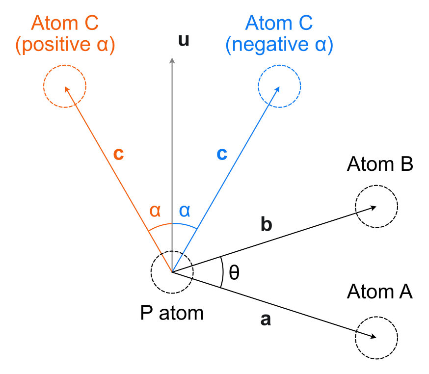

================
Pyramidalization
================

Pyramidalization can be calculated as described by Agranat and Radhakrishnan
:footcite:`radhakrishnan_measures_1991` and Gavrish
:footcite:`gavrish_approximate_2012`.

******
Module
******

The Pyramidalization class calculates and stores the pyramidalization values.

.. code-block:: python
  :caption: Example

  >>> from morfeus import read_geometry, Pyramidalization
  >>> elements, coordinates = read_geometry("pyr.xyz")
  >>> pyr = Pyramidalization(coordinates, 1)
  >>> pyr.P
  0.9382253758236183
  >>> pyr.P_angle
  7.578832545944509

The first value is the *P* value according to Agranat and Radhakrishnan while
the second one is that of Gavrish.  In the example above, the index of the
pyramidalized atom is given, together with the coordinates of the molecule.
Mᴏʀғᴇᴜs then needs to determine the neighbors of this atom in order to
calculate the appropriate angles (see `Background`_). Either the indices of the
neighbors can be given explicitly with ``neighbor_indices=<list>`` or Mᴏʀғᴇᴜs
will try to determine the neighbors automatically. The strategy is controlled
by the ``method=<str>`` keyword argument:

``method="distance"``
  This is the default method that simply selects the three atoms closest in
  space.

``method="connectivity"``
  Connectivity is determined from covalent radii. This method requires either
  that ``radii`` or ``elements`` are given. The Pyykko covalent radii are used
  by default.

*******************
Command line script
*******************

The functionality is also available from the command line.

.. code-block:: console
  :caption: Example

  $ morfeus pyramidalization pyr.xyz - 1 - print_report
  P: 0.938
  P_angle: 7.579

**********
Background
**********

#########################
Agranat and Radhakrishnan
#########################

Pyramidalization can be calculated for any tetracoordinate atom as described in
:footcite:`radhakrishnan_measures_1991`. Here, the pyramidalization *P* is
calculated from the two angles *ɑ* and *θ* defined in the figure

.. math::

  P = \sin{\theta} \bullet \cos{\alpha}

The angle *θ* is measured between the two vectors **a** and **b** going from
the pyramidalized atom to two of the substituent atoms A and B. The angle *ɑ*
is measured between the vector **c** going from the phosphorus atom to the
third substituent atom C, and the normal vector **u** to the plane defined by
**a** and **b**. An important alteration to the original recipe is made for
extreme cases of pyramidalization, as suggested by Tobias Gensch. When the
angle between vector **c** and the sum of vectors **a** and **b** is acute, the
*α* angle is taken as negative. If *ɑ* is negative, the final pyramidalization
value *P* is taken as 2 − *P* and can therefore be larger than unity. There are
three possible values of *ɑ* that can be obtained by choosing **a** and **b**
differently. The sign of *ɑ* is taken from the average of these three angles.

  Definition of α angle as negative for extreme pyramidalization.

#######
Gavrish
#######

An alternative and related measure of pyramidalization is due to Gavrish
:footcite:`gavrish_approximate_2012`:

.. math::

  P = \sqrt{360° - \sum{\theta}}

where *θ* is the bond angle in the figure and the sum is over the three
possible bond angles.

.. footbibliography::
