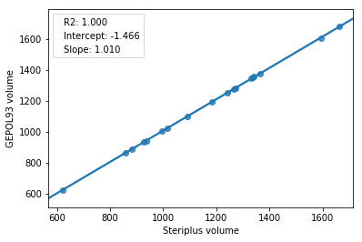

===============================
Solvent accessible surface area
===============================
Solvent accessible surface areas (SASAs), atomic SASAs and volumes under the
SASA can be calculated.

*******************
Command line script
*******************

The command-line script outputs total SASA and volume as well as SASA per atom.

.. code-block:: console
  :caption: Example

  $ morfeus_sasa n-heptane.xyz
  Probe radius (Å): 1.4
  Solvent accessible surface area (Å^2): 331.6
  Volume inside solvent accessible surface (Å^3): 475.6
  Atom      Index     Area (Å^2)
  C         1         18.4
  C         2         4.5
  H         3         17.0
  H         4         16.0
  H         5         18.4
  H         6         13.8
  H         7         20.5
  H         8         15.3
  H         9         15.5
  H         10        1.6
  H         11        21.8
  H         12        17.2
  C         13        2.7
  C         14        0.2
  C         15        4.5
  C         16        6.4
  C         17        6.5
  C         18        14.7
  H         19        21.8
  H         20        0.6
  H         21        10.9
  H         22        17.1
  H         23        18.3
  H         24        20.5
  H         26        13.7
  H         25        13.7

-d, --density <float>  Density of points in Å^2 (default: 0.01)
-p, --probe <float>  Probe radius in Å (default: 1.4)
--radii <str>  Choice of vdW radii: ``crc`` (default) or ``bondi``

******
Module
******

The SASA class calculates and stores the total and atomic SASA as well as the
volume.

.. code-block:: python
  :caption: Example

  >>> from morfeus import SASA, read_xyz                                                             
  >>> elements, coordinates = read_xyz("n-heptane.xyz")                                                
  >>> sasa = SASA(elements, coordinates)  
  >>> print(sasa.atom_areas[1])                                                                        
  18.380429455791376
  >>> print(sasa.area)                                                                           
  331.5607124071378
  >>> print(sasa.volume)
  475.5699458352845

The ``atom_areas`` dictionary contains the atomic SASAs indexed from 1. Type of
radii can be changed with the keyword argument ``radii=<str>`` with either 
``crc`` (default) or ``bondi``. Custom radii can be supplied with 
``radii=<list>``. The probe radius is change with ``probe_radius=<float>``.

For more information, use ``help(SASA)`` or consult the API:
:py:class:`morfeus.morfeus.SASA`

**********
Background
**********
Solvent accessible surface area is a measure of how much of the area of a
molecule is available to the solvent. The atomic SASA can be used as a
measure of the steric availability of an atom. morfeus uses a modified version
of the method of Shrake and Rupley [1]_ where a constant surface density of 
points is used instead of fixed number of points regardless of the atom area.
The atomic SASA and volumes are computed as described by Eisenhaber *et al.*
[2]_. morfeus is not optimzed for larger molecules and other programs are
recommended for, *e.g.*, proteins.

Results have been compared against FreeSASA [3]_ and GEPOL93 [4]_ on a set of 
transition metal complexes with results that correlate well. FreeSASA uses the
Shrake and Rupley algorithm while GEPOL93 uses the one by Lee and Richards [5]_.
Setting were CRC radii, a probe radius of 1.4 Å and a density of 0.1 Å^2/point
for morfeus. The same total number of points were used for FreeSASA, while
GEPOL93 uses the finest setting (NDIV=5).

.. figure:: benchmarks/SASA/total_areas.png

  Benchmark of total SASA against FreeSASA and GEPOL93.

.. figure:: benchmarks/SASA/atom_areas.png
  
  Benchmark of atom SASA against FreeSASA and GEPOL93.

  
  Benchmark of volume against GEPOL93.

**********
References
**********

.. [1] Shrake, A.; Rupley, J. A. *J. Mol. Biol.* **1973**, *79*, 351.
.. [2] Eisenhaber, F.; Lijnzaad, P.; Argos, P.; Sander, C.; Scharf, M.
      *J. Comput. Chem.* **1995**, *16*, 273.
.. [3] Mitternacht, S. *F1000Research* **2016**, *5*.
.. [4] Pascual-Ahuir, J. L.; Silla, E.; Tuñon, I.
       *J. Comput. Chem.* **1994**, *15*, 1127.
.. [5] Lee, B.; Richards, F. M. *J. Mol. Biol.* **1971**, *55*, 379.