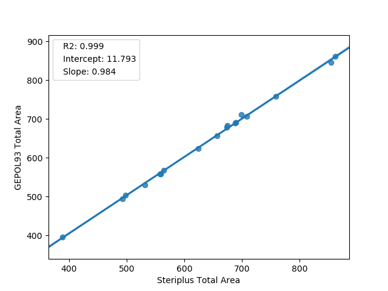
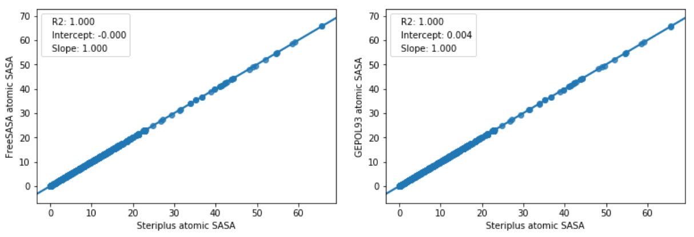

===============================
Solvent accessible surface area
===============================
Solvent accessible surface areas (SASAs) are calculated using the *rdFreeSASA* 
module of RDKit [1]_. This feature is therefore only available if RDKit is 
installed and does not work on Windows currently. 

*******************
Command line script
*******************

The command-line script outputs total SASA and area per atom. If all is well,
the sum of the atom areas should be the same as the total.

.. code-block:: console
  :caption: Example

  $ steriplus_sasa n-heptane.xyz
  Total SASA (Å^2): 327.899
  Sum of atom areas (Å^2): 327.899
  Atom areas (Å^2):
      1    18.892
      2     4.174
      3    16.721
      4    15.575
      5    18.111
      6    13.779
      7    20.615
      8    15.017
      9    15.584
     10     1.530
     11    21.597
     12    16.931
     13     2.366
     14     0.061
     15     4.301
     16     6.754
     17     6.782
     18    14.881
     19    21.804
     20     0.184
     21    10.298
     22    16.741
     23    18.129
     24    20.601
     25    13.237
     26    13.231

--radii <str>  Choice of vdW radii: ``crc`` (default) or ``bondi``

******
Module
******

The SASA class calculates and stores the total and atomic SASA.

.. code-block:: python
  :caption: Example

  >>> from steriplus import SASA, read_xyz                                                             
  >>> elements, coordinates = read_xyz("n-heptane.xyz")                                                
  >>> sasa = SASA(elements, coordinates)  
  >>> print(sasa.atom_areas[1])                                                                        
  18.89153083600655
  >>> print(sasa.total_area)                                                                           
  327.8990380394403

The ``atom_areas`` dictionary contains the atomic SASAs indexed from 1. Type of
radii can be changed with the keyword argument ``radii=<str>`` with either 
``crc`` (default) or ``bondi``. Custom radii can be supplied with 
``radii=<list>``.

For more information, use ``help(SASA)`` or consult the API:
:py:class:`steriplus.steriplus.SASA`

**********
Background
**********
Solvent accessible surface area is a measure of how much of the area of a
molecule is available to the solvent [2]_. The atomic SASA can be used as a
measure of the steric availability of an atom.

SASA is computed using RDKit based on the FreeSASA program by Mitternacht [1]_.
The algorithm is the one by Lee and Richards with the default probe radius of
1.4 Å.

Results have been compared against the GEPOL93 program on a series of transition
metal complexes with results that correlate well [3]_.

  Benchmark of total SASA against GEPOL93.

  
  Benchmark of atom SASA against GEPOL93.

**********
References
**********

.. [1] Mitternacht, S. *F1000Research* **2016**, *5*.
.. [2] Lee, B.; Richards, F. M. *J. Mol. Biol.* **1971**, *55*, 379.
.. [3] Pascual-Ahuir, J. L.; Silla, E.; Tuñon, I.
       *J. Comput. Chem.* **1994**, *15*, 1127.