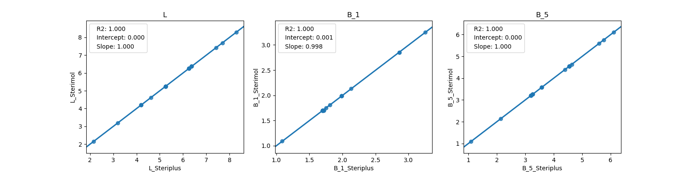

========
Sterimol
========

The Sterimol parameters L, B\ :sub:`1` and B\ :sub:`5` as described by
Verloop [1]_\ [2]_ are implemented. Note that Sterimol parameters should be 
calculated with H as the dummy atom, to be consistent with the literature
(see `Background`_)

*******************
Command line script
*******************

The command line script gives access to the basic functionality from the
terminal.

.. code-block:: console
  :caption: Example
  
  $ morfeus_sterimol tBu.xyz 1 2
  L         B_1       B_5
  4.21      2.87      3.27

Here the second argument is the dummy atom (called atom 1 below) and the third
argument is the atom of the substituent to which atom 1 is connected (called 
atom 2 below).

--radii <list>
  Type of van der Waals radii: ``bondi`` or ``crc`` (default)
--density <str>
  Density of points on spheres (default: ``0.005`` points/Å\ :sup:`2`)
-v, --verbose
  Print uncorrected L and bond length between atom 1 and atom 2.

******
Module
******

The Sterimol class calculates and stores Sterimol parameters.

.. code-block:: python
  :caption: Example
  
  >>> from morfeus import Sterimol, read_xyz
  >>> elements, coordinates = read_xyz("tBu.xyz")
  >>> sterimol = Sterimol(elements, coordinates, 1, 2)
  >>> sterimol.L_value
  4.209831193078874
  >>> sterimol.B_1_value
  2.8650676183152837
  >>> sterimol.B_5_value
  3.26903261263369
  >>> sterimol.print_report()
  L         B_1       B_5
  4.21      2.87      3.27

Radii can be changed with the argument ``radii_type=<str>`` with the choices
``crc`` (default) or ``bondi``. Custom radii can be supplied as a list with 
``radii=<list>``. 

The bond length between atoms 1 and 2 and the uncorrected L values (without
the historical addition of 0.40 Å) can also be obtained.

.. code-block:: python
  :caption: Uncorrected L values

  >>> sterimol.L_value_uncorrected
  3.8098311930788737
  >>> sterimol.bond_length
  1.1
  >>> sterimol.print_report(verbose=True)
  L         B_1       B_5       L_uncorr  d(a1-a2)
  4.21      2.87      3.27      3.81      1.10

More information can be found with `help(Sterimol)` or in the API:
:py:class:`morfeus.morfeus.Sterimol`

**********
Background
**********

The Sterimol parameters were developed by Verloop to describe the steric size
of substituents. The atom attached to the substituent in the calculation (by 
definition H) is called atom 1 and the first atom in the substituent is called
atom 2. L can be described as the depth of the substituent. It is defined as
the length of the vector going from atom 1, through atom 2 and ending on the
tangent of the vdW surface. For historical reasons, L is corrected by adding
0.40 Å to this length. This  was due to a shift from using C(sp\ :sup:`2`) to
H as dummy atom.

B\ :sub:`1` and B\ :sub:`5` can be described as the minimum and maximum
rotational size of the substituent. They are defined as the shortest and
longest vectors from atom 2 to a tangent plane of the vdW surface which are
perpendicular to the L vector, respectively.

morfeus has been benchmarked against Paton's Sterimol_ package. Using exactly
the same radii (Paton's modified Bondi), almost identical results are obtained.
(Note that morfeus normally uses 1.20 Å as the Bondi vdW radius for H).

  
  Benchmark of Sterimol parameters against Paton's Sterimol code.

morfeus calculates the B\ :sub:`1` and B\ :sub:`5` parameters by a different
approach from the original code. First, atomic spheres are created with a
certain density of points. B\ :sub:`1` and B\ :sub:`5` are then obtained by
projection of the points of the convex hull onto vectors spanning the whole
360 degrees in the plane perpendicular to L. B\ :sub:`5` is obtained from the
largest projection, while B\ :sub:`1` is obtained from the smallest maximum
projection for the set of vectors.

**********
References
**********

.. [1] Verloop, A., Hoogenstraaten, W., Tipker, J. In *Drug Design* Vol. VII;
       Ariens, E. J., Ed.; Academic Press, **1976**; pp 165-206.  
.. [2] Verloop, A. In *Pesticide Chemistry: Human Welfare and Environment:
       Synthesis and Structure-Activity Relationships*;
       Doyle, P., Fujita, T., Eds.; Pergamon, **1983**; pp 339–344.

.. _`convex hull`: https://en.wikipedia.org/wiki/Convex_hull
.. _Sterimol: https://github.com/bobbypaton/Sterimol