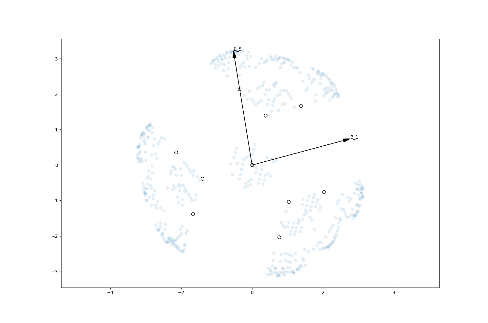
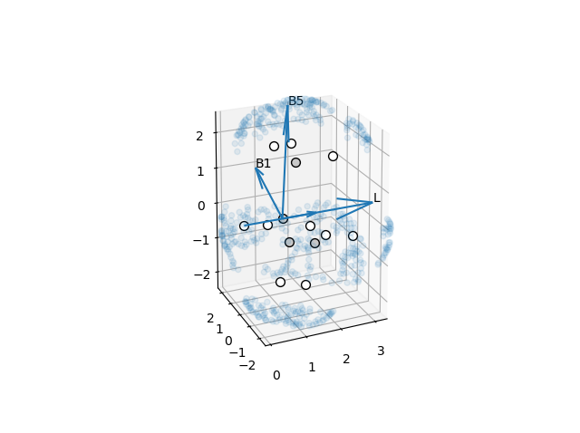

========
Sterimol
========

*******************
Command line script
*******************

.. code-block:: console
  :caption: Example

******
Module
******

The Sterimol class calculates and stores Sterimol parameters.

.. code-block:: python
  :caption: Example
  
  >>> from steriplus import Sterimol, read_xyz
  >>> elements, coordinates = read_xyz("tBu.xyz")
  >>> sterimol = Sterimol(elements, coordinates, 1, 2)
  >>> sterimol.L_value
  4.209831193078874
  >>> sterimol.B_1_value
  2.8650676183152837
  >>> sterimol.B_5_value
  3.26903261263369
  >>> sterimol.print_report()
  L         B_1       B_5
  4.21      2.87      3.27

The bond length and uncorrected L values (without the historical 0.40 Å added)
can also be obtained.

.. code-block:: python
  :caption: Uncorrected L values

  >>> sterimol.L_value_uncorrected
  3.8098311930788737
  >>> sterimol.bond_length
  1.1
  >>> sterimol.print_report(verbose=True)
  L         B_1       B_5       L_uncorr  d(a1-a2)
  4.21      2.87      3.27      3.81      1.10

2D and 3D plots can also be obtained to visualize the vectors

.. code-block:: python
  :caption: 2D plot
  
  >>> sterimol.plot_2D()

.. code-block:: python
  :caption: 3D plot

  >>> sterimol.plot_3D()

More information can be found with `help(Sterimol)` or in
:py:class:`steriplus.steriplus.Sterimol`

**********
Background
**********

The Sterimol parameters were developed by Verloop to describe the steric size
of substituents. L can be described as the depth of the substituent and is
defined as the distance between the dummy atom 1 (by definition H) and its
neighbor in substituent. For historical reasons, L is corrected by adding 0.40
to this length. This difference is due to a shift from C(sp\ :sup:`2`) to H
as dummy atom.

B\ :sub:`1` and B\ :sub:`5` can be described as the minimum and maximum
rotational size of the substituent. They are defined as the shortest and longest
vectors from atom 2 to a tangent plane of the vdW surface.

Steriplus has been benchmarked against Paton's Sterimol_ package. Using the same
radii (Paton's modified Bondi), almost identical results are obtained. Note that
the Sterimol package uses 1.09 Å as the vdW radius for H, while Steriplus 
normally uses 1.10 Å as default (CRC radii).

.. figure:: benchmarks/sterimol/correlation.png
  
  Benchmark of Sterimol parameters against Paton's Sterimol code.

Steriplus calculates the B\ :sub:`1` and B\ :sub:`5` paramters by a different
approach. First, atomic spheres are created with a certain density of points.
Then, the so-called `convex hull`_ is created, reducing the number of points
drastically. B\ :sub:`1` and B\ :sub:`5` are obtained by projection of the
points of the convex hull onto vectors spanning the whole 360 degrees in the
plane perpendicular to L. B\ :sub:`5` is the largest projection, while 
B\ :sub:`1` is the smallest maximum projection for the set of vectors.

**********
References
**********

.. [1] Verloop, A., Hoogenstraaten, W., Tipker, J. In Drug Design Vol. VII;
       Ariens, E. J., Ed.; Academic Press, 1976; pp 165-206.  
.. [2] Verloop, A. In Pesticide Chemistry: Human Welfare and Environment:
       Synthesis and Structure-Activity Relationships;
       Doyle, P., Fujita, T., Eds.; Pergamon, 1983; pp 339–344.

.. _`convex hull`: https://en.wikipedia.org/wiki/Convex_hull
.. _Sterimol: https://github.com/bobbypaton/Sterimol